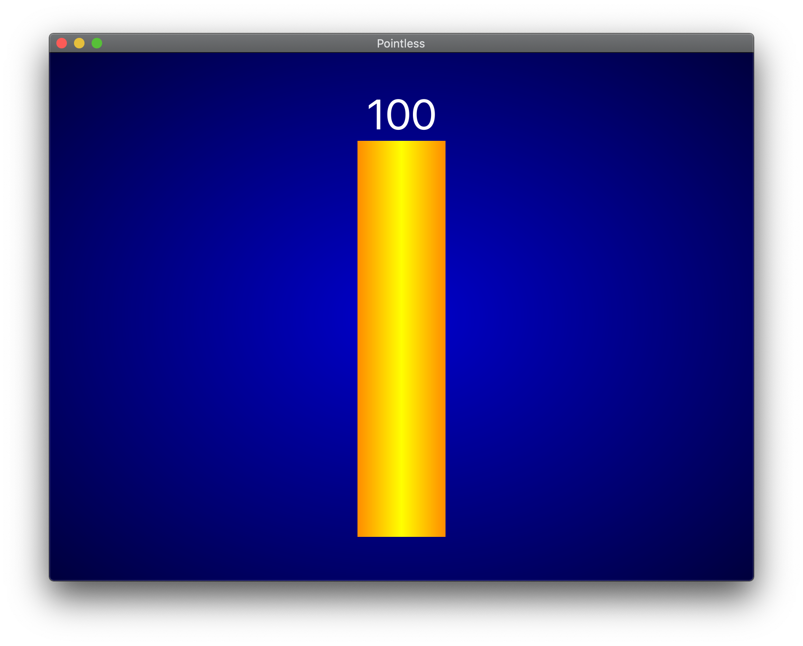
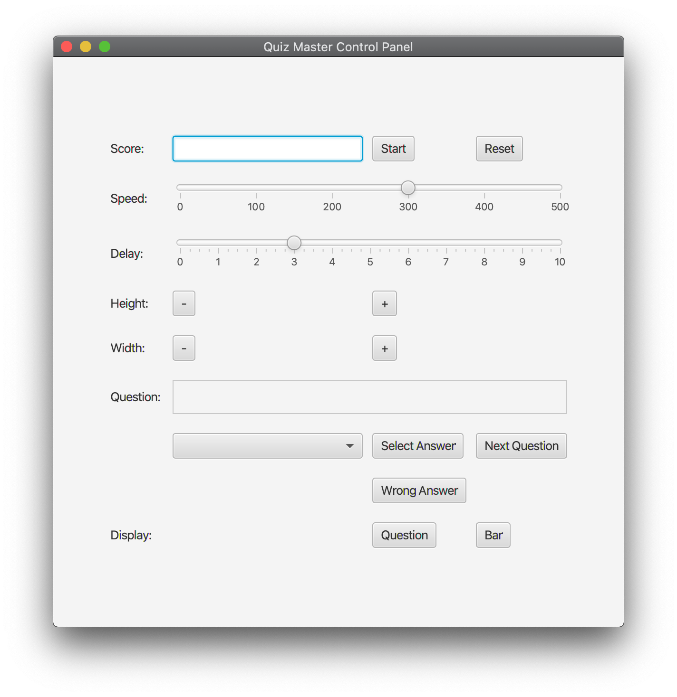

# Pointless

Implementation of the game board used in the [television game show](https://www.bbc.co.uk/programmes/b00rhg2r) on the BBC.

## Getting started

- Install Java 11
- Install Gradle
```
./gradlew run
```



